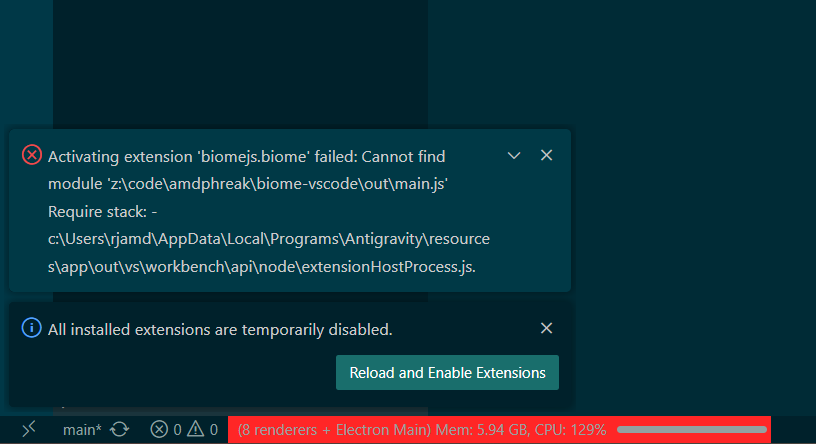

# Biome VS Code Extension Fails to Find Global pnpm/bun Install

## Description

The `biome-vscode` extension fails to locate a global Biome installation (e.g., installed via `pnpm` or `bun`) if the global `npm` path lookup fails or returns undefined.

This happens because the `findBiomeInGlobalNodeModules` method in `src/locator.ts` performs an early `return` when it encounters a missing path for any package manager, instead of `continue`-ing to check the next one.

## Bug Proof

## Resolution

A PR has been submitted to fix this logic error by replacing the `return` with a `continue`.

- **PR:** https://github.com/biomejs/biome-vscode/pull/945
- **Issue:** https://github.com/biomejs/biome-vscode/issues/944
