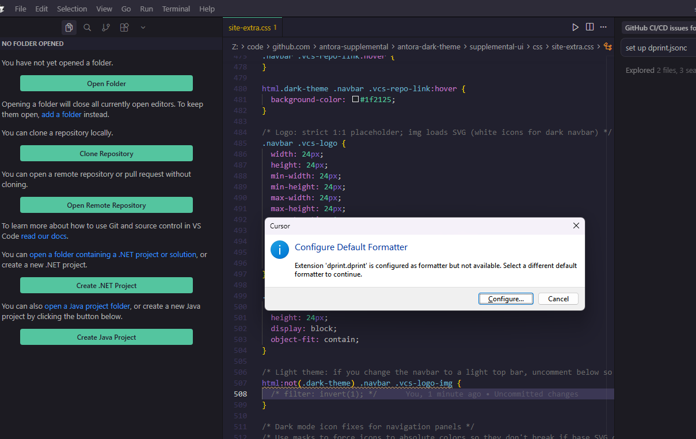

# Issue: Allow formatting files outside of active workspace

## Description

The `dprint-vscode` extension currently restricts formatting to files specifically within active workspace folders. This prevents using `dprint` as a general-purpose formatter for files opened individually or outside the scope of the current project.

## Steps to Reproduce

1. Set `dprint.dprint` as the default formatter for a language (e.g., JSON) in VS Code settings.
2. Open a workspace or no workspace at all.
3. Open a file that is *not* located within any of the active workspace folders.
4. Attempt to format the document.

## Expected Behavior

`dprint` should attempt to format the file, potentially falling back to a global configuration or searching for a configuration file in the file's ancestor directories.

## Actual Behavior

The extension silently ignores the formatting request because it cannot match the file to an active workspace folder. VS Code may fall back to a generic error message. When no folder is opened at all, the IDE shows: **"Extension 'dprint.dprint' is configured as formatter but not available."** (See evidence screenshot below.)

## Evidence

- Left: sidebar shows "NO FOLDER OPENED" (no workspace loaded).
- Right: dialog shows dprint configured as formatter but "not available."
- File open: e.g. a CSS file from a path that has `dprint.jsonc`; formatting still unavailable because the folder is not loaded in the editor.

## Proposed Strategy

1.  Add a global "fallback" folder service to `WorkspaceService.ts` that handles files not matched to any open workspace.
2.  This fallback service acts as if it's running from the file system root, allowing `dprint` to resolve configurations normally (either global or local to the file).

## Links

- Main GitHub Issue: <https://github.com/dprint/dprint-vscode/issues/136>
- Related dprint Issue: <https://github.com/dprint/dprint/issues/1091>
- PR: *Not yet submitted.* Issue #136 mentions a commit in a fork; a PR has not been opened or linked. Once opened, link it here and in the GitHub issue.
