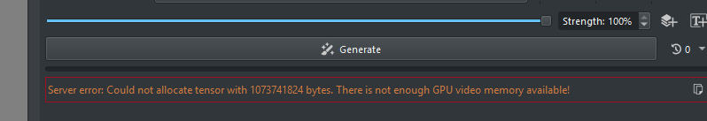

# Flux Nunchaku: GPU OOM for 1 GB Tensor Allocation & Missing CPU Fallback

The Krita AI Diffusion plugin fails to fall back to CPU/RAM when a GPU tensor allocation fails during Flux Nunchaku inference. Specifically, a 1 GB tensor allocation fails even when significant system RAM is available.

## Symptoms:

1. **GPU Allocation Failure**: During Flux generation (using Nunchaku), a "Could not allocate tensor with 1 GB" error occurs.
2. **No CPU Fallback**: Despite Nunchaku supporting CPU offloading, the current implementation in the plugin for Flux does not appear to trigger it, leading to a hard crash of the job.
3. **Screenshot**: The error clearly indicates that GPU memory is insufficient and no fallback is attempted.



## Investigative Findings:

In `ai_diffusion/comfy_workflow.py`, the `nunchaku_load_flux_diffusion_model` call (line 578) is missing the `cpu_offload="auto"` parameter, which is present in other Nunchaku loaders within the same file:

- **Missing in Flux**:
  ```python
  def nunchaku_load_flux_diffusion_model(self, model_path: str, cache_threshold: float):
      return self.add_cached(
          "NunchakuFluxDiTLoader", 1, model_path=model_path, cache_threshold=cache_threshold
      )
  ```

- **Present in Qwen/ZImage**:
  ```python
  def nunchaku_load_qwen_diffusion_model(self, model_name: str, num_blocks_on_gpu=1):
      return self.add_cached(
          "NunchakuQwenImageDiTLoader",
          1,
          model_name=model_name,
          cpu_offload="auto",  # <--- Present here
          num_blocks_on_gpu=num_blocks_on_gpu,
          use_pin_memory="disable",
      )
  ```

This discrepancy suggests that Flux Nunchaku is being forced to run entirely on GPU, which is problematic for cards with 6-8 GB VRAM.

## Resolution:

Add `cpu_offload="auto"` to the `NunchakuFluxDiTLoader` call in `comfy_workflow.py`.
