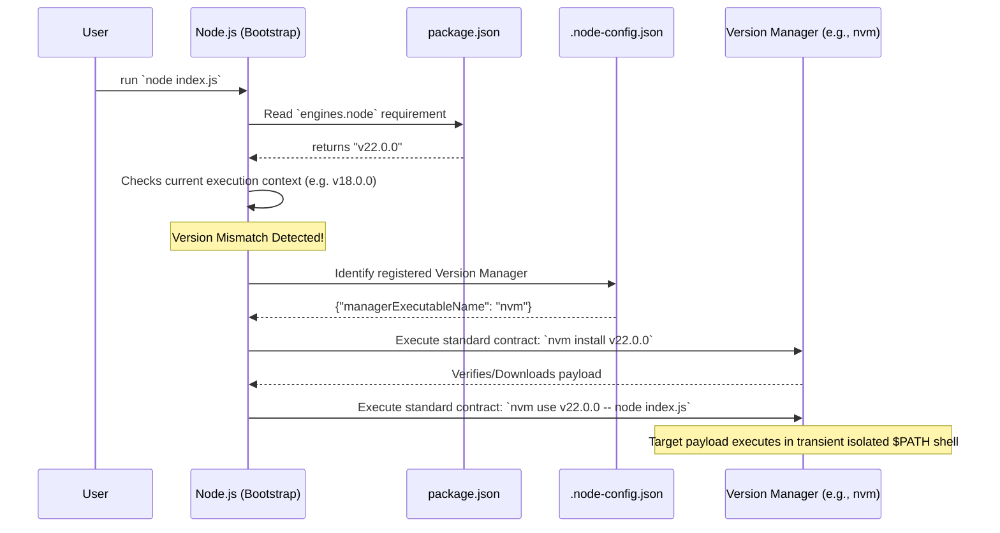

# Issue: Node Version Managers have not implemented a universal Node API

## Description

Currently, Node Version Managers (nvm, fnm, nvs, volta, etc) operate by arbitrarily hooking into developers' system shells (PowerShell, bash, zsh, cmd) or manipulating global OS environment/registry configurations (`$PATH`, Symlinks).

The result is extremely brittle behaviour and conflicting tools. When a developer changes repositories and works on a project requiring Node v18 down from Node v22 (indicated by `engines.node` in `package.json`), the developer's execution of `npm install` silently fails or produces incompatible build artifacts.

If Node itself implemented a universal settings file strategy (like `~/.node-config.json` or a global binary configuration array), package managers could simply *register* their execution namespace (e.g. `nvm`, `fnm`) against the standardized Node runtime parameters.

Then, when `node` executes, it would evaluate the current context (such as `engines.node` in the local repo `package.json`), identify a version mismatch, look at its globally registered version managers, and dynamically execute `{managerExecutableName} install {version}` and `{managerExecutableName} use {version}` seamlessly.

This correctly forces `node` to govern its own version context requirements, while still completely abstracting the complexity of local file systems, proxy logic, or HTTP download locations entirely to the arbitrarily registered version managers acting behind a common API contract.

## Proposed NVM-Windows Implementation

To establish this design paradigm and lead the ecosystem towards standardizing a configuration interface:

- `nvm` registers its namespace into the configuration. Node relies on the fact that any registered manager perfectly adheres to the standardized Node CLI API contract (`install <version>`, `use <version>`, `set <version>`) keeping behavior consistent between Windows, Mac, and Linux:

```json
{
  "versionManagers": [
    {
      "managerExecutableName": "nvm"
    }
  ]
}
```

## Execution Flow Diagram

The following sequence diagram outlines the standardized interception and bootstrapping process when a developer attempts to execute a script:



## Output Sample

To the developer, this would act as a totally transparent and automatic environment correction without clobbering their other terminal sessions:

```text
> node server.js

[Node.js Bootstrap] Version mismatch detected. 'package.json' requires v22.0.0, but v18.0.0 is active.
[Node.js Bootstrap] Delegating to registered adapter: 'nvm'

[nvm] Checking local cache for v22.0.0... Not found.
[nvm] Downloading Node.js v22.0.0... Complete.
[nvm] Spawning isolated transient shell with v22.0.0 injected to execute payload...

Server listening on port 3000...
```
