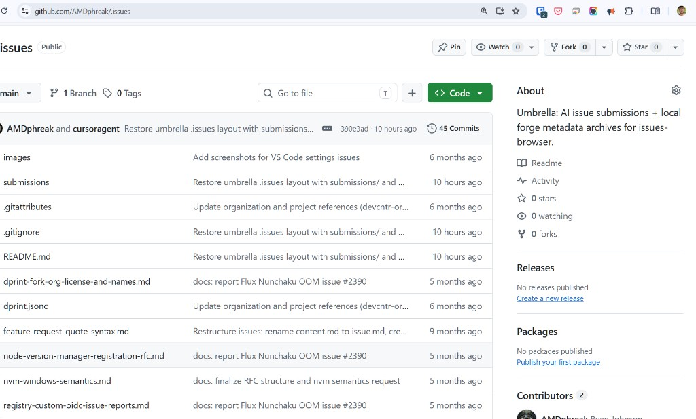
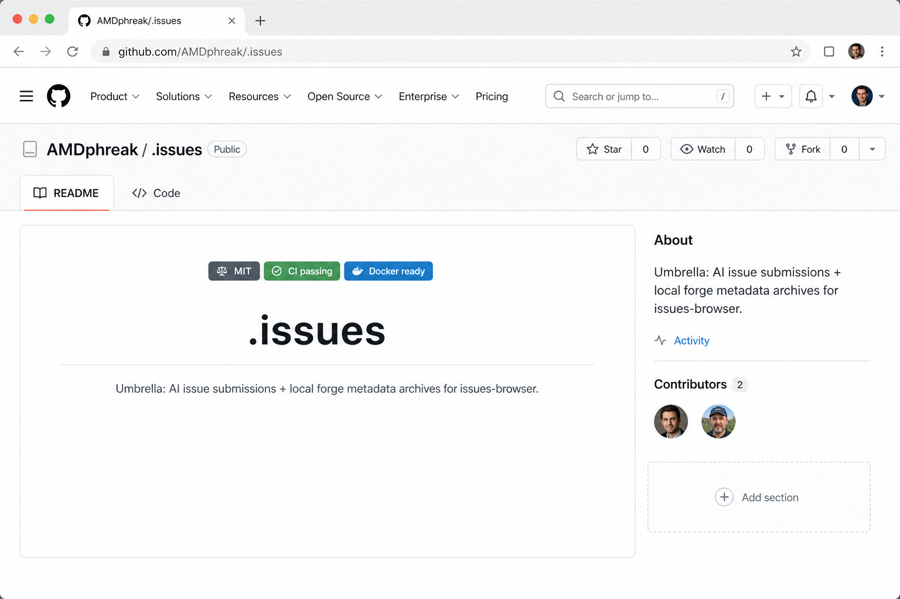
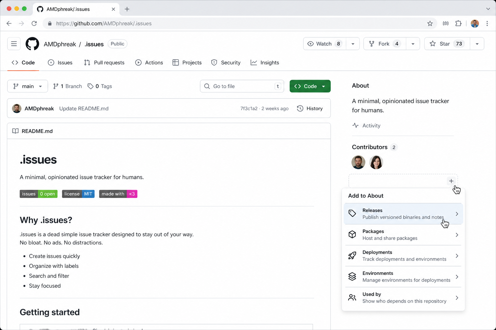
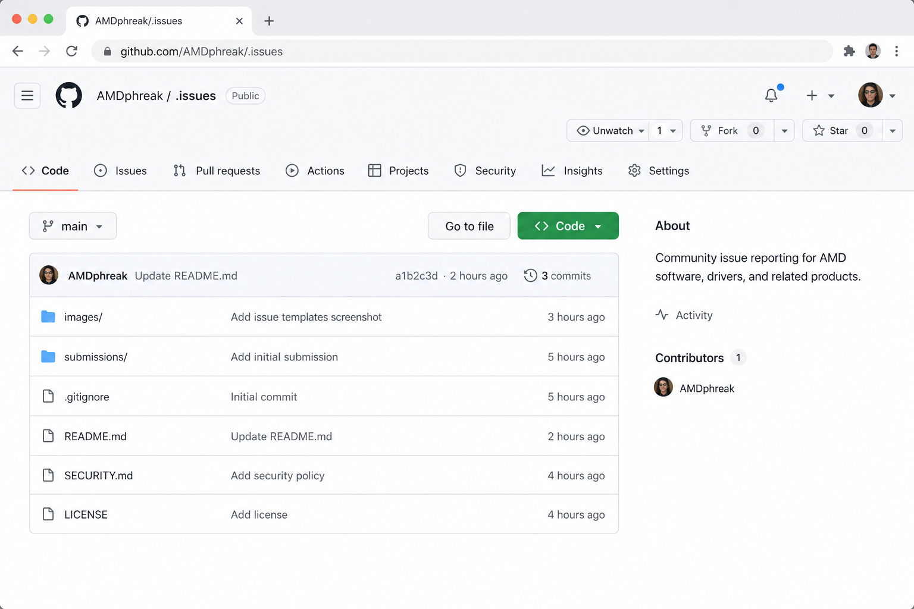

# Repo homepage: visitor-first layout (hide empty sidebar, README before files)

## Summary

GitHub repository pages optimize for **repo owners/maintainers**, not for the much larger audience of visitors and potential contributors. Empty sidebar sections (`Releases`, `Packages`, …), duplicated status chrome, and a large file browser above the README push the project’s actual story below the fold.

## Problem

On a typical repo with no releases/packages (example: `AMDphreak/.issues`):

1. **Empty sections still occupy the sidebar** — “No releases published” / “No packages published” are owner CTAs, not visitor information.
2. **About repeats header actions** — stars / watching / forks already live in the top bar; “Readme” is noise when a README is present (and should vanish when absent).
3. **File browser dominates the first viewport** — most visitors want meaning (README), not a directory dump. Owners who need the tree already know where Code is.

This is the same class of mismatch as git’s vocabulary (checkout, origin, master) being optimized around the person who created the repo rather than people joining later.

External signal (same thesis, 2026): [GitHub Needs a Meaning First Makeover](https://anish95.medium.com/github-needs-a-meaning-first-makeover-in-2026-d3fb4d42e27d). Older redesign critiques (e.g. Tonsky / Grumpy Website) hit related hierarchy problems.

## Proposal

### A. Progressive disclosure for unpopulated sidebar sections

- **Default:** only show sections that have real content (latest release, published package, contributors, website, topics, …).
- **Always-on minimal set** (suggestion): description/topics (if set), website (if set), Activity, Contributors — plus header Pin/Watch/Fork/Star.
- **Owner/maintainer hover affordance:** in the empty region under populated items, show a `+` control that opens a short list of addable sections. Hovering a row briefly expands a one-line explanation (“Releases — publish versioned binaries and notes”).
- **No README → no Readme link** in About.

### B. README-first / Code tab on the repo home

Either:

1. **Tabs:** sticky `README` | `Code` (default `README` when present; otherwise `Code`), or
2. **Order flip:** README above the file tree (file tree collapsible / moved below).

Sticky tabs that pin under the repo nav when switching views would keep navigation cheap without forcing a full page reload mental model.

## Mockups (PoC)

Current (owner-oriented empty chrome + files first):

Proposed — README first, empty Releases/Packages gone, owner `+` affordance:

Proposed — hover `+` → addable sections with brief descriptions:

Proposed — Code tab for the file tree:

## Why a new Community discussion (vs commenting)

Searched Repositories / related feedback; no existing thread combines (1) hide-empty sidebar progressive disclosure and (2) README-first / sticky Code↔README tabs with concrete mockups. Partial adjacent ideas exist (extra README-adjacent tabs, general UI density complaints, userscript workarounds). A **new Product Feedback** post in **Repositories** is the stronger signal: mockups travel better as a standalone proposal than as a comment on a tangential thread.

## Non-goals

- Removing Releases/Packages for repos that use them.
- Hiding owner tools from owners (only change *default visibility* and *progressive disclosure*).
